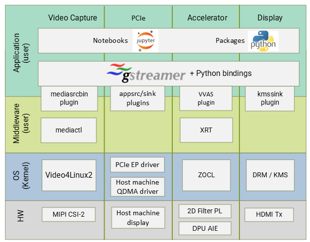
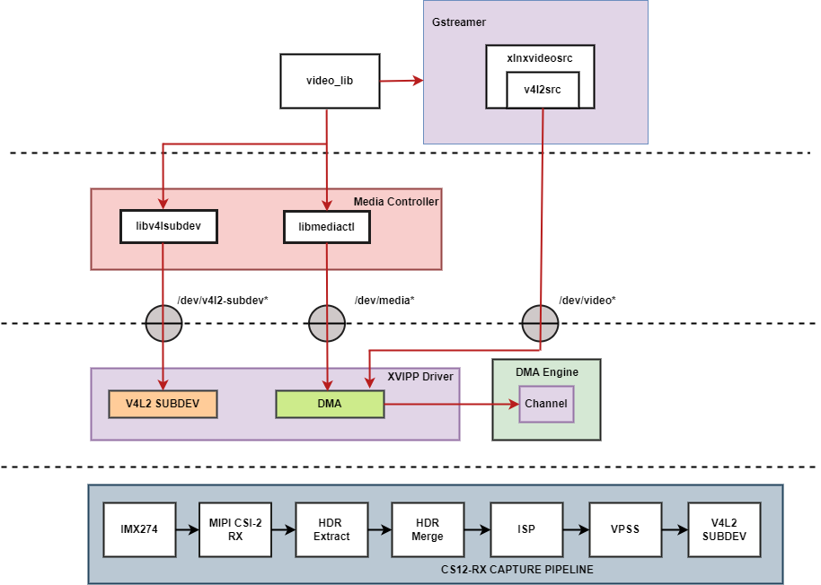
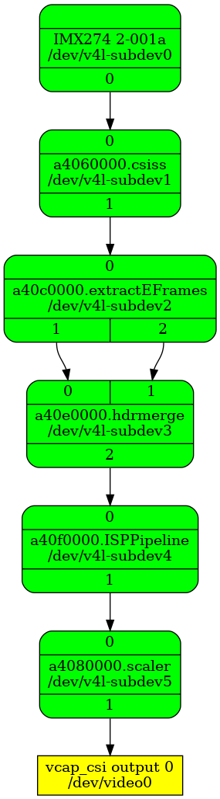
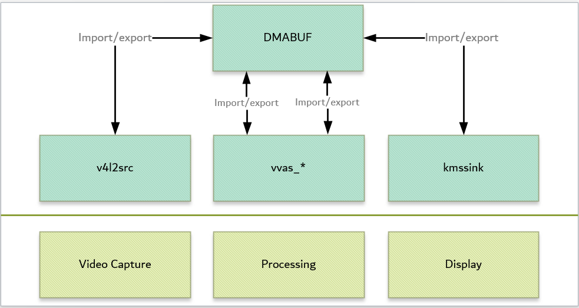
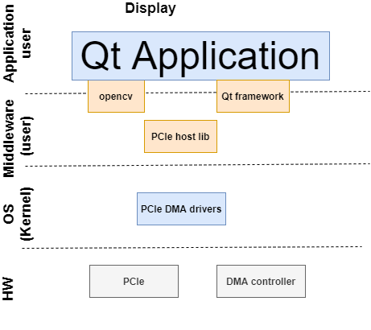
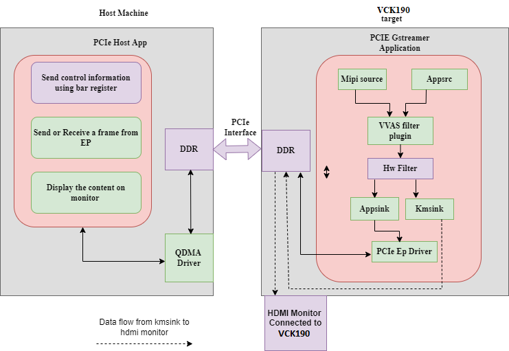
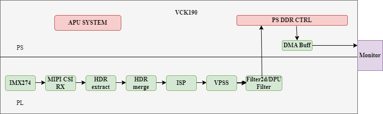
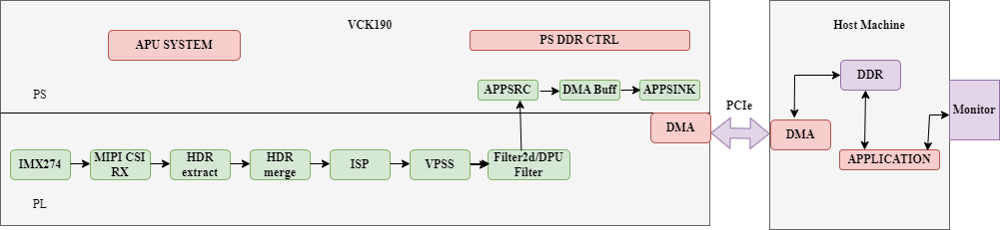
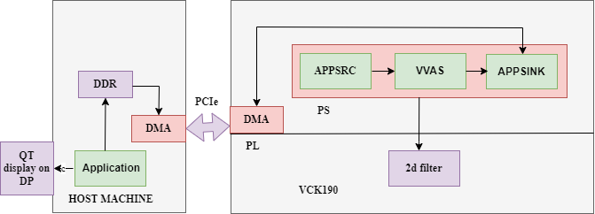
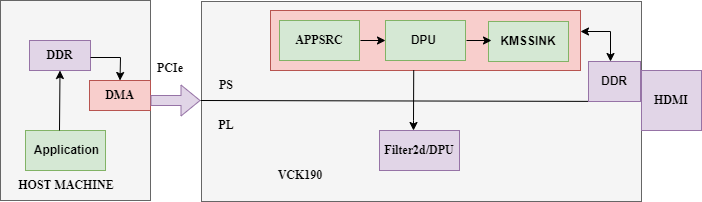

Software Architecture of the Platform
=====================================
Introduction
------------

This chapter describes the application processing unit (APU) Linux
software stack and x86 host software stack. The stack and vertical domains are shown in the
following figure.

   Linux Software Stack and Vertical Domains

The Endpoint software stack is horizontally divided into the following layers:

* Application layer (user-space)
	- G-streamer/Jupyter notebooks with a simple control and visualization interface.     
	- GStreamer multimedia framework with python bindings for video pipeline control.
* Middleware layer (user-space)
	- Implements and exposes domain-specific functionality by means of GStreamer plugins to interface with the application layer.
	- Provides access to kernel frameworks.
* Operating system (OS) layer (kernel-space)
	- Provides a stable, well-defined API to user-space.
 	- Includes device drivers and kernel frameworks (subsystems).
	- Access to hardware IPs

Vertically, the Endpoint software components are divided by domain :

* Video capture
* Accelerator
* Display
* PCIe End-point driver

The subsequent chapters describe the components of each vertical domain first and cover
application layer components next.

Video Capture
-------------

The Video Capture software stack is depicted in the following figure
using the single-sensor MIPI CSI capture pipeline as an example

   Video Capture Software Stack

At a high level it consists of the following layers from top to bottom:

-  User-space layers

   -  GStreamer: Media source bin plugin (wrapper around generic v4l2src
      plugin)
   -  Media controller: Library to configure v4l subdevices and media
      devices

-  Kernel-space layers

   -  V4L2/Media subsystems: Xilinx video IP pipeline (XVIPP) driver
   -  DMA engine: Xilinx framebuffer driver

Media Source Bin GStreamer Plugin
^^^^^^^^^^^^^^^^^^^^^^^^^^^^^^^^^

The mediasrcbin plugin is designed to simplify the usage of live video
capture devices in this design, otherwise the user must take care of
initialization and configuration. The plugin is a bin element that
includes the standard v4l2src GStreamer element. It configures the media
pipelines of the supported video sources in this design.

The v4l2src element inside the mediasrcbin element interfaces with the V4L2 Linux
framework and the Xilinx VIPP driver through the video device node. The
mediasrcbin element interfaces with the Media Controller Linux framework
through the v412-subdev and media device nodes which allows you to
configure the media pipeline and its sub-devices. It uses the
libmediactl and libv4l2subdev libraries which provide the following
functionality:

-  Enumerate entities, pads and links
-  Configure sub-devices

   -  Set media bus format
   -  Set dimensions (width/height)
   -  Set frame rate
   -  Export sub-device controls

The mediasrcbin plugin sets the media bus format and resolution on each
sub-device source and sink pad for the entire media pipeline. The
formats between pads that are connected through links need to match.
Refer to the Media Framework section below for more information on
entities, pads and links.

Kernel Subsystems
~~~~~~~~~~~~~~~~~

In order to model and control video capture pipelines such as the ones
used in this TRD on Linux systems, multiple kernel frameworks and APIs
are required to work in concert. For simplicity, we refer to the overall
solution as Video4Linux (V4L2) although the framework only provides part
of the required functionality. The individual components are discussed
in the following sections.

Driver Architecture
^^^^^^^^^^^^^^^^^^^

The Video Capture Software Stack figure in the Capture section shows how
the generic V4L2 driver model of a video pipeline is mapped to the
single-sensor MIPI CSI-2 Rx capture pipelines. The video pipeline driver
loads the necessary sub-device drivers and registers the device nodes it
needs, based on the video pipeline configuration specified in the device
tree. The framework exposes the following device node types to user
space to control certain aspects of the pipeline:

- Media device node: /dev/media*
- Video device node: /dev/video*
- V4L2 sub-device node: /dev/v4l-subdev*

Media Framework
^^^^^^^^^^^^^^^

The main goal of the media framework is to discover the device topology
of a video pipeline and to configure it at run-time. To achieve this,
pipelines are modeled as an oriented graph of building blocks called entities connected through pads.

An entity is a basic media hardware building block. It can correspond to a large variety of blocks such as
physical hardware devices (e.g. image sensors), logical hardware devices
(e.g. soft IP cores inside the PL), DMA channels or physical connectors.
Physical or logical devices are modeled as sub-device nodes and DMA
channels as video nodes.

A pad is a connection endpoint through which an entity can interact with other entities. Data produced by an entity
flows from the entity's output to one or more entity inputs. A link is a
point-to-point oriented connection between two pads, either on the same
entity or on different entities. Data flows from a source pad to a sink
pad.

A media device node is created that allows the user space
application to configure the video pipeline and its sub-devices through
the libmediactl and libv4l2subdev libraries. The media controller API
provides the following functionality:

- Enumerate entities, pads and links
- Configure pads

  -  Set media bus format
  -  Set dimensions (width/height)

- Configure links
- Enable/disable
- Validate formats

The following figures show the media graphs for MIPI CSI-2 Rx (single-sensor) 
capture pipeline as generatedby the media-ctl utility.
The subdevices are shown in green with their corresponding control interface base
address and subdevice node in the center. The numbers on the edges are
pads and the solid arrows represent active links. The yellow boxes are
video nodes that correspond to DMA channels, in this case write channels
(outputs).

   Video Capture Media Pipeline: Single MIPI CSI-2 RX

V4L2 Framework
^^^^^^^^^^^^^^
The V4L2 framework is responsible for capturing video frames at the video device node, typically
representing a DMA channel, and making those video frames available to user space.
The framework consists of multiple sub-components that provide certain functionality.

Before video frames can be captured, the buffer type and pixel format need to be set using the
VIDOC_S_FMT ioctl. On success the driver can program the hardware, allocate resources, and
generally prepare for data exchange. Optionally, you can set additional control parameters on
V4L devices and sub-devices. The V4L2 control framework provides ioctls for many commonly
used, standard controls such as brightness and contrast.

The videobuf2 API implements three basic buffer types but only physically contiguous memory is
supported in this driver because of the hardware capabilities of the Frame Buffer Write IP.
Videobuf2 provides a kernel internal API for buffer allocation and management as well as a userspace
facing API. VIDIOC_QUERYCAP and VIDIOC_REQBUFS ioctls are used to determine the
I/O mode and memory type. In this design, the streaming I/O mode in combination with the
DMABUF memory type is used.

DMABUF is dedicated to sharing DMA buffers between different devices, such as V4L devices or
other video-related devices such as a DRM display device (see the GStreamer Pipeline Control
section). In DMABUF, buffers are allocated by a driver on behalf of an application. These buffers
are exported to the application as file descriptors.

For capture applications, it is customary to queue a number of empty buffers using the
VIDIOC_QBUF ioctl. The application waits until a filled buffer can be de-queued with the
VIDIOC_DQBUF ioctl and re-queues the buffer when the data is no longer needed. To start and
stop capturing applications, the VIDIOC_STREAMON and VIDIOC_STREAMOFF ioctls are used.

The ioctls for buffer management, format and stream control are implemented inside the v4l2src
plugin and the application developer does not need to know the implementation details.

Video IP Drivers
^^^^^^^^^^^^^^^^

Xilinx adopted the V4L2 framework for most of its video IP portfolio.
The currently supported video IPs and corresponding drivers are listed
under V4L2. Each V4L driver has a sub-page that lists driver-specific
details and provides pointers to additional documentation. The following
table provides a quick overview of the drivers used in this design.

Table : V4L2 Drivers Used in Capture Pipelines

+-----------------------------------------+------------------------------------------------------------------------------------------------------------------------------+
| Linux Driver                            | Function                                                                                                                     |
+=========================================+==============================================================================================================================+
| Xilinx Video Pipeline (XVIPP)           | - Configures video pipeline and register media, video and sub-device nodes.                                                  |
|                                         | - Configures all entities in the pipeline and validate links.                                                                |
|                                         | - Configures and controls DMA engines (Xilinx Video Framebuffer Write).                                                      |
|                                         | - Starts/stops video stream.                                                                                                 |
+-----------------------------------------+------------------------------------------------------------------------------------------------------------------------------+
| Xilinx Video Processing Subsystem       | - Sets media bus format and resolution on input pad.                                                                         |
| (Scaler Only configuration)             | - Sets media bus format and resolution on output pad. (Output configuration can be different from the input configuration as |
|                                         |   the block enables color space conversion and scaling).                                                                     |
+-----------------------------------------+------------------------------------------------------------------------------------------------------------------------------+
| MIPI CSI-2 Rx                           | - Sets media bus format and resolution on input pad.                                                                         |
|                                         | - Sets media bus format and resolution on output pad.                                                                        |
+-----------------------------------------+------------------------------------------------------------------------------------------------------------------------------+
| Xilinx Video Image Signal Processing    | - Sets media bus format and resolution on input pad.                                                                         |
| (ISP)                                   | - Sets media bus format and resolution on output pad.                                                                        |
+-----------------------------------------+------------------------------------------------------------------------------------------------------------------------------+
| Sony IMX274 Image Sensor                |  - Sets media bus format and resolution on output pad.                                                                       |
|                                         |  - Sets sensor control parameters: exposure, gain, test pattern, vertical flip.                                              |
+-----------------------------------------+------------------------------------------------------------------------------------------------------------------------------+
| HDR Extract                             | - Sets media bus format and resolution on input pad.                                                                         |
|                                         | - Sets media bus format and resolution on two output pads.                                                                   |
|                                         | - Configure HDR Extract IP and stream data to produce Short Exposure Frame (SEF) and Long Exposre Frames(LEF).               |
+-----------------------------------------+------------------------------------------------------------------------------------------------------------------------------+
| HDR Merge                               | - Sets media bus format and resolution on two input pads.                                                                    |
|                                         | - Sets media bus format and resolution on output pad.                                                                        |
|                                         | - Configure HDR Merge IP and stream data to produce a single HDR Frame from SEF and LEF.                                     |
+-----------------------------------------+------------------------------------------------------------------------------------------------------------------------------+

Display
-------

The Display software stack is depicted in the following figure.

.. figure:: ../images/display_stack.png
   :alt: Display Software Stack

   Display Software Stack

At a high-level it consists of the following layers from top to bottom which are further described in the next sections:

-  User-space layers

   -  GStreamer: KMS sink plugin
   -  libdrm: DRM user-space library

-  Kernel-space layers

   -  DRM/KMS subsystem: Xilinx DRM driver
   -  DMA engine: Xilinx framebuffer driver

KMS Sink GStreamer Plugin
^^^^^^^^^^^^^^^^^^^^^^^^^

The kmssink element interfaces with the DRM/KMS Linux framework and the Xilinx DRM driver
through the libdrm library and the dri-card device node.

The kmssink element library uses the libdrm library to configure the cathode ray tube controller
(CRTC) based on the monitor's extended display identification data (EDID) information with the
video resolution of the display. It also configures plane properties such as the alpha value.

Libdrm
^^^^^^
The DRM/KMS framework exposes two device nodes to user space: the /dev/dri/card* device
node and an emulated /dev/fb* device node for backward compatibility with the legacy fbdev
Linux framework. The latter is not used in this design. libdrm was created to facilitate the
interface of user space programs with the DRM subsystem. This library is merely a wrapper that
provides a function written in C for every ioctl of the DRM API, as well as constants, structures
and other helper elements. The use of libdrm not only avoids exposing the kernel interface
directly to user space, but presents the usual advantages of reusing and sharing code between
programs.

DRM/KMS Kernel Subsystem
^^^^^^^^^^^^^^^^^^^^^^^^
Linux kernel and user-space frameworks for display and graphics are intertwined and the
software stack can be quite complex with many layers and different standards/APIs. On the
kernel side, the display and graphics portions are split with each having their own APIs. However,
both are commonly referred to as a single framework: DRM/KMS.

This split is advantageous, especially for SoCs that often have dedicated hardware blocks for
display and graphics. The display pipeline driver responsible for interfacing with the display uses
the kernel mode setting (KMS) API and the GPU responsible for drawing objects into memory
uses the direct rendering manager (DRM) API. Both APIs are accessed from user-space through a
single device node.

A brief overview of the DRM is provided but the focus is on KMS as there is no GPU present in
the design.

Direct Rendering Manager
^^^^^^^^^^^^^^^^^^^^^^^^
The Xilinx DRM driver uses the GEM (Graphics Execution Manager) memory manager and
implements DRM PRIME buffer sharing. PRIME is the cross-device buffer sharing framework in
DRM. To user-space PRIME buffers are DMABUF-based file descriptors. The DRM GEM/CMA
helpers use the Continuous Memory Access (CMA) allocator as a means to provide buffer objects
that are physically contiguous in memory. This is useful for display drivers that are unable to map
scattered buffers via an I/O memory management unit (IOMMU).

Frame buffers are abstract memory objects that provide a source of pixels to scan out to a CRTC.
Applications explicitly request the creation of frame buffers and receive an opaque handle that
can be passed to the KMS CRTC control, plane configuration, and page flip functions.

Kernel Mode Setting
^^^^^^^^^^^^^^^^^^^

Mode setting is an operation that sets the display mode including video
resolution and refresh rate. It was traditionally done in user-space by
the X-server which caused a number of issues due to accessing low-level
hardware from user-space which, if done wrong, can lead to system
instabilities. The mode setting API was added to the kernel DRM
framework, hence the name kernel mode setting.

The KMS API is responsible for handling the frame buffer and planes, setting the mode, and
performing page-flips (switching between buffers). The KMS device is modeled as a set of planes,
CRTCs, encoders, and connectors as shown in the Display Software Stack figure in the Display
section. The figure also shows how the driver model maps to the physical hardware components
inside the HDMI Tx display pipeline

CRTC
^^^^
CRTC is an antiquated term that stands for cathode ray tube controller, which today would be
simply named display controller as CRT monitors have disappeared and many other display types
are available. The CRTC is an abstraction that is responsible for composing the frame to be
scanned out to the display and setting the mode of the display.

In the Xilinx DRM driver, the CRTC is represented by the video mixer. The bottom-most plane is
the primary plane (or master layer) and configured statically in the device-tree. The primary plane
always matches the currently configured display resolution set by the CRTC (width and height)
with X- and Y-offsets set to 0. The primary plane can be overlayed with up to eight overlay
planes inside the video mixer.

Plane
^^^^^

In this design, the primary plane can be overlayed and/or alpha-blended with up to eight
additional planes inside the video mixer. The z-order (foreground or background position) of the
planes is fixed. The global alpha mode can be configured per plane through the driver by means
of custom KMS properties: an alpha value of 0% (or 0) means the layer is fully transparent
(invisible); an alpha value of 100% (or 255) means that the layer is fully opaque.

Each overlay plane's width, height, X- and Y-offset is run-time programmable relative to the
primary plane or CRTC which determines the display resolution. The pixel formats of the primary
plane as well as the eight overlay planes are fixed: one BGR plane (primary) plus four YUY2
planes (overlay) plus four BGR planes (overlay) from bottom to top.

The Xilinx DRM driver supports the universal plane feature, therefore the primary plane and
overlay planes can be configured through the same API. A page-flip is the operation that
configures a plane with the new buffer index to be selected for the next scan-out. The new
buffer is prepared while the current buffer is being scanned out and the flip typically happens
during vertical blanking to avoid image tearing.

Encoder
^^^^^^^

An encoder takes pixel data from a CRTC and converts it to a format suitable for any attached
connectors. There are many different display protocols defined, such as HDMI and DisplayPort.
This design uses an HDMI transmitter implemented in the PL which sends the encoded video
data to the HDMI GT Controller and PHY. The PHY serializes the data using the GTY transceivers
in the PL before it goes out via the HDMI Tx connector on the board.

Connector
^^^^^^^^^

The connector models the physical interface to the display. The
HDMI protocols use a query mechanism to receive data
about the monitor resolution, and refresh rate by reading the extended
display identification data (EDID) (see VESA Standard ) stored inside
the monitor. This data can then be used to correctly set the CRTC mode.
HDMI also supports hot-plug events to detect if a cable has been
connected or disconnected as well as handling display power management
signaling (DPMS) power modes.

-  User-space layers

   -  GStreamer: alsasrc and alsasink plugins
   -  Alsa-lib: ALSA user-space library

-  Kernel-space layers

   -  ALSA: Xilinx ALSA ASoC driver

QDMA Drivers
------------

QDMA driver on the host machine is used to identify VCK190 device connected to the host machine via PCIe interface and perform data transfer through DMA.

Please refer to below link for more details on QDMA drivers:
https://github.com/Xilinx/dma_ip_drivers/tree/master/QDMA/linux-kernel.

PCIe End Point Driver
^^^^^^^^^^^^^^^^^^^^^
 
Endpoint driver is used to communicate with the Host using dedicated BAR. Endpoint driver makes use of DMA framework available in linux kernel by which it exports DMA buffers as file descriptors to userspace and import a DMA buffer from userspace using a file descriptor previously exported for a different or the same device.

For initiating DMA transfers through pcie, Endpoint driver registers two interrupts i.e., DMA read and DMA write interrupts and one more interrupt to acknowledgement host that DMA transfer is complete. The BAR registers described below are used as control information between host and endpoint.  

Below table provide the purpose of each PCIe User Space Registers in both endpoint driver and host application.
		
.. figure:: ../images/pcie_user_space_reg.png 
   :alt: PCIe_USER SPACE REGISTERS

   PCIe User Space Registers

GStreamer
---------

GStreamer is a cross-platform open source multimedia framework that provides infrastructure to
integrate multiple multimedia components and create pipelines/graphs. GStreamer graphs are
made of two or more plugin elements which are delivered as shared libraries. The following is a
list of commonly performed tasks in the GStreamer framework:

- Selection of a source GStreamer plugin
- Selection of a processing VVAS plugin
- Selection of a sink GStreamer plugin
- Creation of a GStreamer graph based on above plugins plus capabilities
- Configuration of properties of above GStreamer plugins
- Control of a GStreamer pipeline/graph

Plugins
^^^^^^^

The following GStreamer plugin categories are used in this design:

- Source
	- mediasrcbin: V4l2 sources such as USB webcam, MIPI single-sensor, MIPI quad-sensor
	- multisrc/filesrc: video file source for raw or encoded image/video files

- Sink
	- kmssink: KMS display sink for HDMI Tx
	- filesink: video file sink for raw or encoded image/video files
	- appsink: sink that makes video buffers available to an application such as the display inside	jupyter notebooks

- Encode/decode
	- jpegenc/dec: jpg image file encode/decode
	- vp9enc/dec: vp9 video file encode/decode

- Processing/acceleration
	- VVAS Infrastructure Plug-ins or VVAS Custom Plug-ins

- Other
	- capsfilter: filters capabilities
	- tee: tee element to create a fork in the data flow
	- queue: creates separate threads between pipeline elements and adds additional buffering
	- perf: measure frames-per-seconds (fps) at an arbitrary point in the pipeline

Capabilities
^^^^^^^^^^^^

The pads are the element's interface to the outside world. Data streams from one element's
source pad to another element's sink pad. The specific type of media that the element can handle
is exposed by the pad's capabilities. The following capabilities are used between the video-source
plugin and its peer plugin (either video-sink or video-processing). These capabilities (also called
capsfilter) are specified while constructing a GStreamer graph, for example:

::

		"video/x-raw, width=<width of videosrc>, height=<height of videosrc>,format=YUY2, ramerate=<fps/1>"

If multisrc is used as video-source plugin, the videoparse element is used instead of a capsfilter to
parse the raw video file and transform it to frames:

::

		"video/x-raw, width=<width of videosrc>, height=<height of videosrc>,format=YUY2, framerate=<fps/1>"

Pipeline Control
^^^^^^^^^^^^^^^^

The GStreamer framework is used to control the GStreamer graph. It provides the following
functionality:

- Start/stop video stream inside a graph
- Get/set controls
- Buffer operations
- Get frames-per-second information

There are four states defined in the GStreamer graph: "NULL", "READY", "PAUSED", and
"PLAYING". The "PLAYING" state of a GStreamer graph is used to start the pipeline and the
"NULL" state is to stop the pipeline.

Allocators
^^^^^^^^^^

GStreamer abstracts buffer allocation and pooling. Custom allocators and buffer pools can be
implemented to accommodate custom use-cases and constraints. The video source controls
buffer allocation, but the sink can propose parameters in the negotiation phase.

The DMABUF framework is used to import and export buffers in a 0-copy fashion between
pipeline elements, which is required for high-performance pipelines, as shown in the following
figure. The ``v4l2src``, ``kmssink``, and ``vvas`` elements are all capable of
allocating and exporting as well as importing DMABUFs to/from their peer
elements.

   DMABUF Sharing Mechanism

Note that DMABUFs are not necessarily physically contiguous depending on the underlying
kernel device driver, that is, the UVC v4l2 driver does not allocate CMA memory which results in
a data copy if its peer element can only handle contiguous memory.

Host machine software stack
---------------------------

   Host machine software stack
   

The Host machine software stack is horizontally divided into the following layers

* Application layer (user-space)
	- A Qt based command-line application to display media content on monitor received from endpoint. 
	
* Middleware layer (user-space)
	- Pcie host lib to access PCIe BAR register and perform dma transfers.
	
* Operating system (OS) layer (kernel-space)
	- Provides a stable, well-defined API to user-space.
 	- Includes device drivers and kernel frameworks (subsystems).
	- Access to hardware IPs.

Host machine userspace software components
^^^^^^^^^^^^^^^^^^^^^^^^^^^^^^^^^^^^^^^^^^

**Qt application**

* command-line application to communicate control information between host abd endpoint via pcie-host lib.
* displays media content on monitor received from endpoint. 

**PCIe Host lib**
	
Library functions to perform dma tranfers using dma xfer utils and access PCIe BAR register to communicate control information between host and 	endpoint 
	

Communication between x86 machine (Host) and  target
----------------------------------------------------

Following diagram captures, all the components involved in achieving different usecases(both from Host and Device perspective) 

   Linux Software Components

Following G-streamer plugins(Python bindings) are supported and provided as part of package.

* Appsrc plugin: 
		Appsrc plugin interacts with PCIe EP driver and gets the media content from the Host over PCIe interface.

* Appsinc Plugin: 
 		Appsync plugin interacts with PCIe EP driver and sends the media content to the Host over PCIe interface.

* vvas_xfilter plugin :
		A generic infrastructure plug-in: 1 input, 1 output, supporting pass-through, in-place, and transform processing.
* pcie_lib: 
		This library provides abstract APIs for the gstreamer python binding jupyter notebook applicationthat interact with PCIe user space configuration. 

Details on Data and control information Flow
--------------------------------------------

At x86 Host machine
^^^^^^^^^^^^^^^^^^^

Data is transferred between the host and the target using the QDMA. QDMA device drivers are installed on the host, 
are used to configure the QDMA IP on the endpoint and to initiate data transfer from the host. The host reads the 
media file from the disk, sends control information to the endpoint, also sends the media file to the endpoint using DMA. 
After receiving filtered output back from the endpoint, the data is displayed on the host monitor. At the device side, 
the OpenCL-based application is used to receive the data, filter it, and send the data back to the host.

A dedicated BAR is used to send control information between Host and the Device and vice-versa.

At Endpoint
^^^^^^^^^^^

In the device, there is a Gstreamer pyton binding jupyter notebook  which loads the xclbin file using XRT and gets
control information with the help of pcie abstract library and EP pcie driver. Depending on the control information, 
setups corresponding usecase, using DMA-BUF mechanism does ZERO copy between the GST plugins and transfers data back 
to the Host. . To achieve better performance instead of buffer copy, endpoint drivers uses DMA-BUF framework available 
in the linux kernel. With the help of DMA-BUF framework zero copy is achieved by just transferring buffer handles between different SW components.

Supported Use cases
-------------------

Following use cases are supported in this release.

1. MIPI --> 2D Image Processing/XVDPU/BYPASS --> HDMI

2. MIPI --> 2D Image Processing/XVDPU/BYPASS --> PCIE/QDMA EP --> PCIE x86 Host(RC) --> Display on Host

3. Raw Video File from Host --> PCIE x86 Host(RC) --> PCIE/QDMA EP --> 2D Image Processing/Bypass --> PCIE/QDMA EP --> PCIE x86 Host(RC) --> Display on Host

4. Raw Video File from Host --> PCIE x86 Host(RC) --> PCIE/XVDPU/QDMA EP --> 2D Image Processing/Bypass --> HDMI

Usecase-1
^^^^^^^^^
**(MIPI --> 2D Image Processing/XVDPU/BYPASS --> HDMI)**

Data is captured using MIPI camera, captured frame is fed through ISP, Scalar blocks. Captured frame is processed through 2d filter( filter IP created using the Vitis™ flow in the PL) or XVDPU and filtered content is displayed on the Monitor which is connected to the HDMI port. 

DMA-BUF mechanism which is available in Linux is used to achieve Zero-copy between G-streamer plugins and to achieve better performance.

Device application provides user interface to configure  Plan-id and Sync parameters 

Usecase-2
^^^^^^^^^
**(MIPI --> 2D Image Processing/XVDPU/BYPASS --> PCIE/QDMA EP --> PCIE x86 Host(RC) --> Display on Host)**

Data is captured using MIPI camera, processed using ISP, Scalar blocks. Captured frame is processed through 2d filter( filter IP created using the Vitis™ flow in the PL) or XVDPU and filtered content is sent to the Host using appsync G-streamer plugin. On the Host data is displayed on the monitor connected to it.

DMA-BUF mechanism which is available in Linux is used to achieve Zero-copy between G-streamer plugins and to achieve better performance.

Host application provides user interface to configure following parameters Height, Width,  Input-format, Kernel-preset, Kernel-mode, Kernel-name, Framerate. Host send all these parameters to the device using the control interface and actual media data is transferred using DMA through PCIe.

Device application provides user interface to configure  Plan-id and Sync parameters 

Usecase-3
^^^^^^^^^
**(Raw Video File from Host --> PCIE x86 Host(RC) --> PCIE/QDMA EP --> 2D Image Processing/Bypass --> PCIE/QDMA EP --> PCIE x86 Host(RC) --> Display on Host)**

Host application reads data from file, using DMA data is transferred to device. On the device Appsrc G-streamer plugin is used to receive the data which is then fed through 2d filter( filter IP created using the Vitis™ flow in the PL)and filtered content is sent back to the Host using Appsync G-streamer plugin. On the Host data is displayed on the monitor connected to it.

DMA-BUF mechanism which is available in Linux is used to achieve Zero-copy between G-streamer plugins and to achieve better performance.

Host application provides user interface to configure following parameters Height, Width,  Input-format, Kernel-preset, Kernel-mode, Kernel-name, Framerate. Host send all these parameters to the device using the control interface and actual media data is transferred using DMA through PCIe.

Device application provides user interface to configure  Plan-id and Sync parameters 

Usecase-4
^^^^^^^^^
**(Raw Video File from Host --> PCIE x86 Host(RC) --> PCIE/QDMA EP --> 2D Image Processing/Bypass --> HDMI)**

Host application reads data from file, using DMA data is transferred to device. On the device Appsrc G-streamer plugin is used to receive the data which is then fed through 2d filter( filter IP created using the Vitis™ flow in the PL) or XVDPU and filtered content is displayed on the Monitor which is connected to the HDMI port by KMSSINK gstreamer plugin.

DMA-BUF mechanism which is available in Linux is used to achieve Zero-copy between G-streamer plugins and to achieve better performance.

Host application provides user interface to configure following parameters Height, Width,  Input-format, Kernel-preset, Kernel-mode, Kernel-name, Framerate. Host send all these parameters to the device using the control interface and actual media data is transferred using DMA through PCIe.

Device application provides user interface to configure  Plan-id and Sync parameters.

,,,,,

Licensed under the Apache License, Version 2.0 (the "License"); you may not use this file
except in compliance with the License.

You may obtain a copy of the License at
http://www.apache.org/licenses/LICENSE-2.0

Unless required by applicable law or agreed to in writing, software distributed under the
License is distributed on an "AS IS" BASIS, WITHOUT WARRANTIES OR CONDITIONS OF ANY KIND,
either express or implied. See the License for the specific language governing permissions
and limitations under the License.

