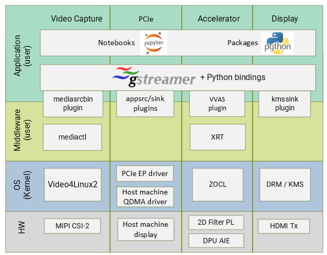

Introduction
============

The Versal PCIe TRD consists of a platform, accelerators and Jupyter
notebooks to demonstrate various aspects of the design. The platform is a Vivado
design with a pre-instantiated set of I/O interfaces and a corresponding
PetaLinux BSP and image that includes the required kernel drivers and user-space
libraries to exercise those interfaces. Accelerators are mapped to FPGA logic
resources and/or AI Engine cores and stitched into the platform using the Vitis
toolchain. The reference designs are implemented for VCK190 evaluation board.

Features
--------
VCK190 PCIe TRD 2022.2 demonstrates following functionalities :

* Video being captured from MIPI image sensor, processed with an accelerator and displayed on a HDMI monitor connected to VCK190 evaluation board.
* Video being captured from MIPI image sensor, processed (optionally) with an accelerator, sent to a x86 host machine (root complex) via PCIe and displayed on a monitor connected to the host machine.
* Video frames being transferred from a file on the host machine to the VCK190 evaluation board (endpoint) through the PCIe QDMA bridge interface, processed (optionally) with an accelerator, sent back to host and displayed on a monitor connected to the host machine. . 
* Video frames being transferred from a file on the host machine to the VCK190 evaluation board (endpoint) through the PCIe QDMA bridge interface, processed (optionally) with an accelerator and displayed on HDMI monitor connected to VCK190 board.

.. _Platform:

Platform
---------

The following is a list of key I/O interfaces of the platform:

* Sources:

  * x86 host machine through the PCIe QDMA bridge interface

  * MIPI CSI-2 image sensor capture pipeline via FMC daughter card
  
  * File source

* Processing:

  * 2D Filter (PL)

  * XVDPU (PL + AIE)

* Sinks:

  * x86 host machine via PCIe
  
  * HDMI Tx + video mixer display pipeline

  * Application sink into jupyter notebook display

Audio replay can be done using a file as an audio source. 

	

Software Stack
--------------

The main software frameworks used in this reference design are:

* Jupyter notebooks for top-level application control and visualization

* GStreamer multimedia framework and plugins for video pipeline creation

* V4L2 kernel subsystem and drivers for video capture devices

* Xilinx run-time (XRT) and Xilinx OpenCL for acceleration kernels

* DRM/KMS kernel subsystem and drivers for display devices

* ALSA kernel subsystem and drivers for audio devices

* PCIe end-point and host machine QDMA drivers

Working of above frameworks are detailed in Chapter 5.

High Dynamic Range Video
------------------------

This TRD supports high dynamic range (HDR) video with capture and display pipelines,
following is a brief introduction. 

**Multi-exposure Digital Overlap High Dynamic Range (DOL-HDR) capture**

High dynamic range image is a technique obtained by combining several different 
exposures frames of the same subject matter. IMX274 camera sensor supports 
capturing objects at two different exposure, HDR extract IP segregates the 
sensor data (DOL data) into short and long exposure frames. HDR merge will 
generate the HDR frame form the data obtained. The HDR frame results in an image
with a greater dynamic range than what is possible by taking one single exposure. 
HDR is useful for recording many real-world scenes containing very bright, 
direct sunlight to extreme shade.

**Note:** 4k HDR video has a max framerate of 30fps, limited by IMX274 sensor.

Design Files
------------

The design source files are available at https://github.com/Xilinx/vck190-pcie-trd.git
It has the following contents:

* Petalinux Board Support Package (BSP)

* Vivado hardware platform project

* Vitis accelerator overlay project

* PCIe host package

* HTML Documentation sources

* README file

The design file hierarchy is shown below:

.. code-block:: bash

   vck190-pcie-trd
   ├── docs
   ├── overlays
   │   ├── filter2d
   │   │   ├── apps
   │   │   │   └── filter2d-notebooks
   │   │   └── kernels
   │   │       ├── filter2d_combined
   │   │       └── filter2d_pl
   │   ├── Vitis_Libraries
   │   │   └── vision
   │   └── xvdpu
   │       ├── apps
   │       │   └── smart-mipi-app
   │       └── kernels
   │           ├── vitis_prj
   │           └── xvdpu_ip
   ├── pcie_host_package
   │   └── qdma
   ├── petalinux
   │   └── xilinx-vck190-pcie-trd
   ├── platforms
   │   ├── scripts
   │   └── vivado
   │       ├── ip
   │       └── vck190_mipiRxSingle_hdmiTx
   └── README.md

In the following tutorials, it is assumed that the design source files are cloned
into a directory referred to as ``$working_dir``, e.g.

.. code-block:: bash

   export working_dir=/path/to/cloned/repo/vck190-pcie-trd

Licenses
--------

The design includes files licensed by Xilinx, AMD, and third parties under the terms
of the GNU General Public License, GNU Lesser General Public License,
BSD License, MIT License, and other licenses. The file
`vck190_pcie_trd_third_party_licenses_and_source_2022_2.tar.gz
<https://www.xilinx.com/bin/public/openDownload?filename=vck190_pcie_trd_third_party_licenses_and_source_2022_2.tar.gz#>`_
contains the complete set of design source files and licenses. You are solely
responsible for checking any files you use for notices and licenses and for
complying with any terms applicable to your use of the design and any third
party files supplied with the design.

,,,,,

Licensed under the Apache License, Version 2.0 (the "License"); you may not use this file
except in compliance with the License.

You may obtain a copy of the License at
http://www.apache.org/licenses/LICENSE-2.0

Unless required by applicable law or agreed to in writing, software distributed under the
License is distributed on an "AS IS" BASIS, WITHOUT WARRANTIES OR CONDITIONS OF ANY KIND,
either express or implied. See the License for the specific language governing permissions
and limitations under the License.

